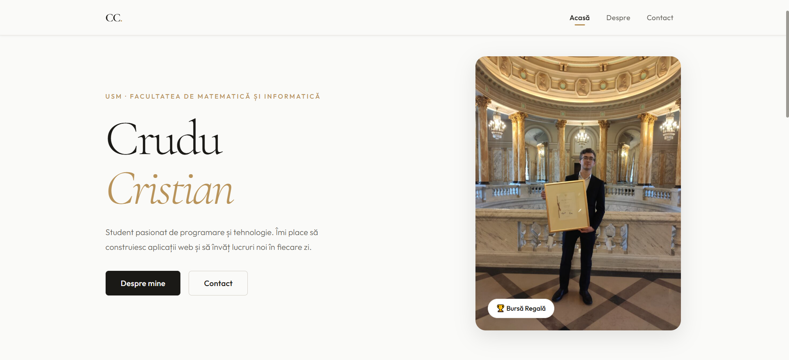
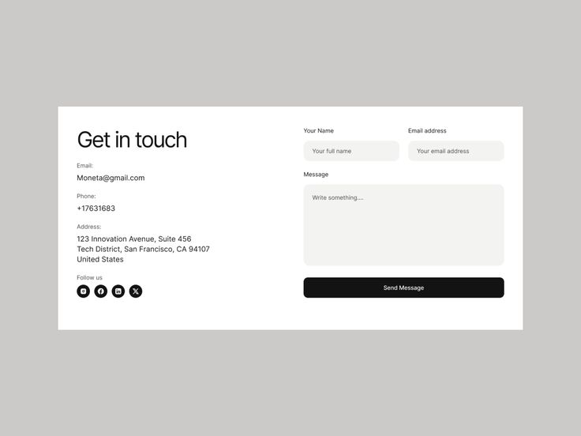
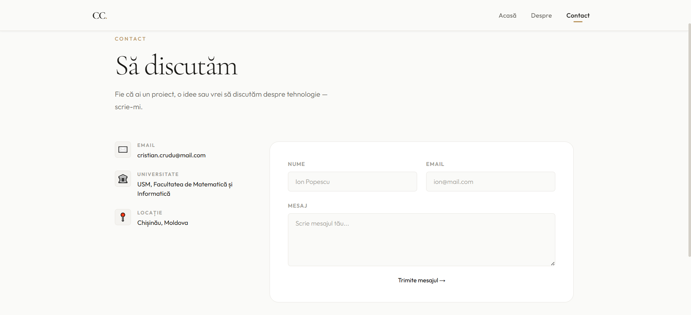

# Componente, Prop-uri & JSX - Implementare de UI Responsive

### 1. Inițiați un nou proiect _React_ utilizând _Vite_.

### 2. Dezvoltați și implementați o pagină web bazată pe proiectul individual realizat în cadrul cursului de _"Design UI/UX"_. Cei care nu au avut un astfel de curs, vor căuta și selecta un design ce trebuie aprobat de profesor. Fișierul _Figma_ să fie inclus în proiect.

### 3. Pagina trebuie sa fie responsive, să oferă o experiență optimă pe diverse dispozitive, de la telefoane mobile la tablete și desktopuri.

### 4. Stilizarea paginii trebuie realizată folosind exclusiv _module CSS_. Este **interzisă** utilizarea bibliotecilor externe de stilizare, precum _Bootstrap_.

### 5. Pentru gestionarea rutelor și navigației în aplicația web, utilizați hook-ul oferit în proiectul exemplu de mai jos.

### 6. Informația repetitivă necesară de a fi afișată pe pagini trebuie să fie salvată în fișiere _.json_.

### 7. Definiți componente cât mai generice (ex: `Button`, `Card`, `Header`) care primesc date prin _props_.

### 8. Utilizați **alias-uri** pentru ușurarea importărilor.

### Exemplu de structură a unui astfel de proiect este [aici](https://github.com/cristi-usm/exemplu-lab3).

---

## Design Inspiratie/Implementare

| Inspirație 1                             | Implementare 1             |
| ---------------------------------------- | -------------------------- |
|  |  |

| Inspirație 2                               | Implementare 2             |
| ------------------------------------------ | -------------------------- |
|  |  |
